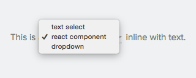

# React Text Select

Simple component to put a invisible `Select` dropdown over a text.

## Installation

    npm install react-textselect --save

## Usage.

    var Textselect = require('react-textselect');

    <TextSelect
        options={['total', 'unique', 'lorem ipsum dolor sit amet']}
        active={this.state.selectedOption}
        onChange={this.onTextSelectChange}/>

### Add styles.

Dont forget to add styles.

    <link rel="stylesheet" href="/node_modules/react-textselect/textselect.css">
